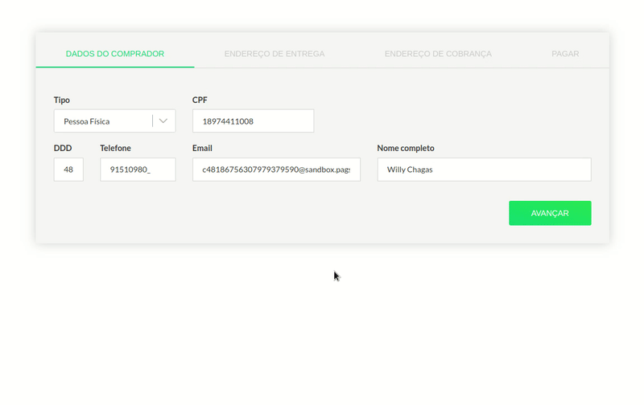

# PAGSEGURO  + REACT


Além dos métodos tradicionais de pagamento (modal e redirecionamento) o pagseguro disponibiliza uma terceira opção o checkout transparente. Com ele é possível que a transação seja feita diretamente em seu site, sem a necessidade de redirecionamento ou modal. É a solução ideal se você deseja customizar o design e manter o cliente em sua aplicação durante a transação.

Tenha em mente que ainda assim você precisará se comunicar com a api do pagseguro via backend. Toda comunicação é feita utilizando o email de cadastro e um token de segurança, sendo assim, você não deve deixar essas informações no frontend por questões de segurança.  

Pagseguro React cuidará da comunicação com a api do pagseguro, validação e estruturação dos dados necessários para que você envie para o pagseguro (via backend). Se você usa nodejs vai gostar do módulo que criei: ([pagseguro-node](https://github.com/wchagas/pagseguro-node)), caso contrário, você encontrará libs para outras linguagens no próprio site do pagseguro.

Caso tenha dificuldades para implementar ou precise de um freelancer entre em contato: **[atah.com.br](https://atah.com.br)**) | chagaswc89@gmail.com. Se curtir o projeto da um apoio com uma estrelinha bacana e me segue por aqui.  





## Instalação

    npm install --save pagseguro-react

## Pagamento

O componente **DirectPayment** deve ser utilizado em caso de compra única. Os métodos disponíveis são: Cartão de crédito, boleto e débito online.

> Você precisará iniciar a sessão em sua api, sem ela o componente se quer será inicializado (**[pagseguro-node](https://github.com/wchagas/pagseguro-node)**).

### Exemplo:
```javascript
    import { DirectPayment } from 'pagseguro-react';

	// constructor...
	this.state = {

	    session: '',

	    sender: {
	        name: 'Willy Chagas',
	        email: 'chagaswc89@gmail.com',
	        phone: {
	            areaCode: '48',
	            number: '991510980',
	        },
	        document: {
	            type: 'CPF',
	            value: '71783955082'
	        },
	    },

	    shipping: {
	        type: 3,
	        cost: 10.00,
	        street: 'Av Campeche',
	        number: 1111,
	        complement: 'Casa',
	        district: 'Campeche',
	        city: 'Florianópolis',
	        state: 'SC',
	        country: 'BRA',
	        postalCode: '88063789'
	    },

	    billing: {
	        street: 'Av Campeche',
	        number: 1111,
	        complement: 'Casa',
	        district: 'Campeche',
	        city: 'Florianópolis',
	        state: 'SC',
	        country: 'BRA',
	        postalCode: '88063789'
	    },

	    items: [
	        {
	            id: 1,
	            description: 'Produto 1',
	            quantity: 2,
	            amount: 2,
	        },  
	        {
	            id: 2,
	            description: 'Produto 2',
	            quantity: 1,
	            amount: 60.00,
	        },  
	        {
	            id: 3,
	            description: 'Produto 3',
	            quantity: 2,
	            amount: 20.00,
	        }

	    ],

	    creditCard: {
	        maxInstallmentNoInterest: 5 // parcelas com desconto
	    },
		extraAmount: 10.00,
        reference: 'Teste Pagseguro React'
	}

	// render...
    <DirectPayment
	    session={this.state.session}
	    extraAmount={this.state.extraAmount}                                       
	    reference={this.state.reference}
	    creditCard={this.state.creditCard}                                         
	    sender={this.state.sender}                                                
	    shipping={this.state.shipping}    
	    billing={this.state.billing}                                               
	    items={this.state.items}                                                   	    
	    onError={this.onError.bind(this)}
	    onSubmit={this.onSubmit.bind(this)}
	/>
```

### Propriedades:

|PROPRIEDADE                          |DESCRIÇÃO                         |
|-------------------------------|-----------------------------|
|`session`            |*String* :: Sessão gerada pela sua api (*obrigatório*)'            |
|`extraAmount`            |*Number* :: Custo extra. Formato com 2 casas decimais (*opcional*)         |
|`reference`            |*String* :: Breve descrição sobre o pagamento. *Você verá essa informação no painel do pagseguro* (*opcional*)'            |
|`creditCard`            |*Object* :: Dados necessários para pagamento via cartão de crédito (*obrigatório*)            |
|`creditCard.maxInstallmentNoInterest`            |*Number* :: Número máximo de parcelas sem juros. Você deve usar esse mesmo valor no backend (*opcional*)'            |
|`sender`| *Object* :: Dados do comprador (*obrigatório*)|
|`sender.name`| *String* :: Nome do comprador (*obrigatório*)|
|`sender.email`| *String* :: Email do comprador (*obrigatório*)|
|`sender.phone.areaCode`| *String* :: Código de área do telefone do comprador (*obrigatório*)|
|`sender.phone.number`| *String* :: Número do telefone do comprador (*obrigatório*)|
|`sender.document.type`| *String* :: Tipo do documento do comprador (CPF ou CNPJ) (*obrigatório*)|
|`sender.document.value`| *String* :: Valor do documento (*obrigatório*)|
|`shipping`| *Object* :: Endereço de entrega (*obrigatório*)|
|`shipping.addressRequired`| *Boolean* :: Caso não precise de endereço. Ex: Compra de e-book. Obs: caso definido como true, o formulário será ocultado e não será necessário passar as propriedades listadas a seguir (*opcional*)|
|`shipping.type`| *Number* :: Tipo do frete (1 = SEDEX) (*opcional*)|
|`shipping.cost`| *Number* :: Custo do frete. Formato com duas casas decimais (*opcional*)|
|`shipping.state`| *String* :: Sigla do Estado. EX: SC   (*obrigatório*)|
|`shipping.city`| *String* :: Cidade (*obrigatório*)|
|`shipping.district`| *String* :: Bairro (*obrigatório*)|
|`shipping.street`| *String* :: Endereço (*obrigatório*)|
|`shipping.number`| *String* :: Número (*obrigatório*)|
|`shipping.complement`| *String* :: Complemento (*opcional*)|
|`shipping.postalCode`| *String* :: Cep (*obrigatório*)|
|`billing`| *Object* :: Endereço de cobrança (*obrigatório*)|
|`billing.state`| *String* :: Sigla do Estado. EX: SC   (*obrigatório*)|
|`billing.city`| *String* :: Cidade (*obrigatório*)|
|`billing.district`| *String* :: Bairro (*obrigatório*)|
|`billing.street`| *String* :: Endereço (*obrigatório*)|
|`billing.number`| *String* :: Número (*obrigatório*)|
|`billing.complement`| *String* :: Complemento (*opcional*)|
|`billing.postalCode`| *String* :: Cep (*obrigatório*)|
|`items`| *Array* :: Itens a serem comprados (*obrigatório*)|
|`items[0].id`| *Number* :: Id do produto (*obrigatório*)|
|`items[0].description`| *String* :: Descrição do produto (*obrigatório*)|
|`items[0].quantity`| *Number* :: Quantidade do item (*obrigatório*)|
|`items[0].amount`| *Number* :: Custo individual do item (*obrigatório*)|
|`hiddenSenderForm`| *Number* :: Ocultar formulário do comprador. (*opcional*)|
|`hiddenShippingForm`| *Number* :: Ocultar formulário de endereço de entrega. (*opcional*)|
|`hiddenBillingForm`| *Number* :: Ocultar formulário de endereço de cobrança. (*opcional*)|
|`exclude`| *Array* :: Ocultar métodos de pagamento. Opções ['CREDIT_CARD', 'ONLINE_DEBIT', 'BOLETO'] (*opcional*)|


### Eventos:

|EVENTO                          |DESCRIÇÃO                         |
|-------------------------------|-----------------------------|
|`onSuccess`            | Disparado em caso de sucesso. Retorna um objeto com todos os dados necessários a serem enviados à sua api.           |
|`onError`            | Disparado em caso de erro.     


### Customização

```css


/*
 * Container
 */
.ps-react-direct-payment {}


/*
 * Loading
 */
.ps-react-loading {}


/**
 * Form
 */
.ps-react-form {}


/**
 * Form Group
 */
.ps-react-form-group {}


/*
 * Label
 */
.ps-react-label {}


/*
 * Input
 */
.ps-react-input{}


/*
 * Select
 */
.ps-react-select{}


/*
 * Select
 */
.ps-react-textarea {}


/*
 * Checkbox
 */
.ps-react-checkbox {}
.ps-react-checkbox:hover input ~ span {}
.ps-react-checkbox:checked input ~ span {}
.ps-react-checkbox:checked input:checked ~ span:after {}
.ps-react-checkbox span:after {}
.ps-react-checkbox label {}
.ps-react-checkbox input {}
.ps-react-checkbox span {}
.ps-react-checkbox span:after {}


/**
 * Error
 */
.ps-react-error{}


/**
 * Tabs Payment Method
 */
.ps-react-tab-payment-method {}
.ps-react-tab-payment-method-active {}


/**
 * Steps
 */
.ps-react-step {}
.ps-react-step-active {}
```
